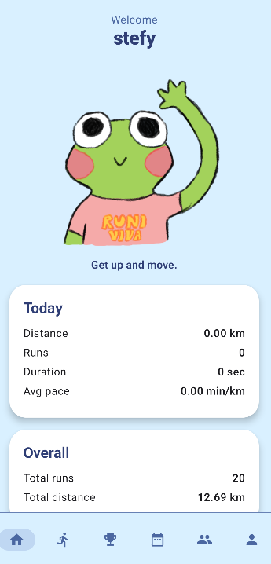
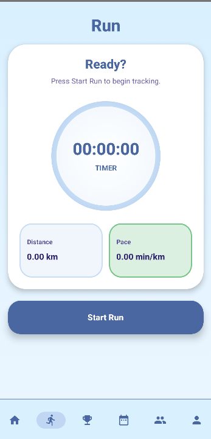
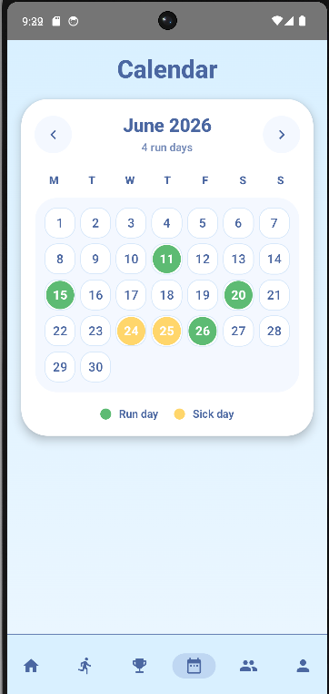
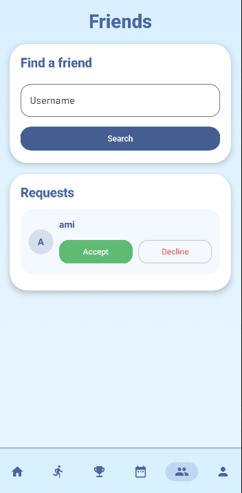
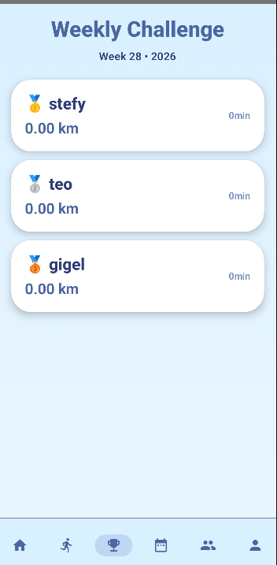
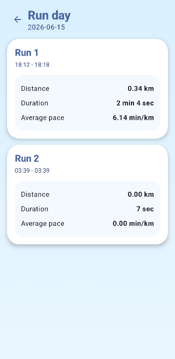
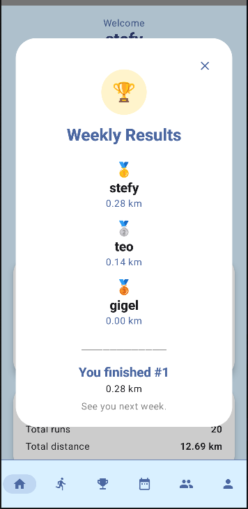
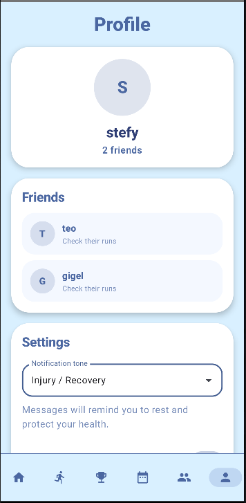

# Runiviva

Runiviva is an Android running application built with Kotlin and Jetpack Compose. It offers GPS run tracking, AI-powered motivational notifications, injury support, friend management, and weekly challenges. The app uses Room for offline storage and Firebase for authentication and cloud synchronization.

## Screenshots

### Home

### Run Tracking

### Calendar

### Friends

### Weekly Challenge

### Run Details

### Results

### Profile

